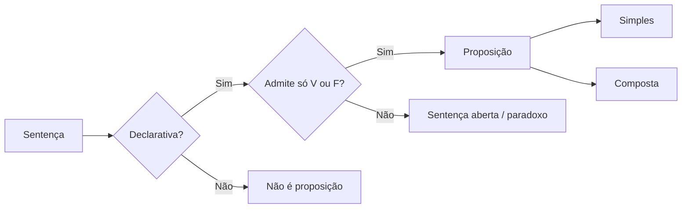

> [!tip] Estude e registre
> Marque as aulas no mapa e desenvolva cada assunto neste caderno. Use títulos, listas, caixas coloridas, imagens e diagramas conforme o conteúdo pedir; cada disciplina mantém seu próprio jeito de explicar.

**Concurso:** PMPE 2026 (Soldado) · **Aulas:** 92 · **Concluídas:** 32

## 🗺️ Mapa do conteúdo

### 1. Estruturas Lógicas (proposições) e Diagramas Lógicos

- [x] Lógica Proposicional

#### Lógica Proposicional — caderno de estudo

> [!abstract] Resumo em uma frase
> É o estudo **matemático** dos argumentos, que separa a **estrutura lógica** da persuasão e diz o que é logicamente **válido ou inválido**.

#### 🎯 Objetivo

- Entender o que a lógica proposicional estuda e por que ela existe.
- Reconhecer os nomes/sinônimos usados pela banca.
- Saber que ~80% das questões de RLM giram em torno disso.

#### 📌 Conceitos-chave

- **Lógica proposicional** — disciplina que avalia a **correção formal** de um argumento (a estrutura), e não se ele convence.
- **Argumento válido** — aquele cuja estrutura garante a conclusão.
- **Argumento inválido** — aquele em que a conclusão não decorre da estrutura.
- **Bivalente** — só admite dois valores lógicos (verdadeiro/falso).

#### 🧠 Explicação

Aristóteles (384–322 a.C.) criou a lógica proposicional para combater os **sofistas**, que venciam debates pelo discurso, mesmo sem razão. Ele quis um critério **formal/matemático** para separar o argumento correto do incorreto.

Pontos importantes:

- Surgiu em Atenas, na **Ágora**, ambiente democrático em que argumentar era decisivo.
- Objetivo: definir o que torna um argumento **correto** ou **incorreto** de modo sistemático.
- Um argumento pode ser **válido e não convencer**, ou **inválido e convencer** — a lógica cuida da validade, não da persuasão.

#### 🗺️ Mapa visual

#### 🔑 Regras / Fórmulas

- **Validade lógica ≠ persuasão retórica.**
- A lógica proposicional é "formal": olha a **estrutura**, não o conteúdo.

#### ⚠️ Pegadinhas

- Achar que um argumento que **convence** é automaticamente **válido** (não é!).
- Confundir **lógica proposicional** com **lógica de 1ª ordem** (estudada depois).
- Esquecer os **sinônimos**: lógica proposicional, formal, clássica, aristotélica, bivalente.

#### ❓ Dúvidas

- [ ] Diferença exata entre lógica proposicional e lógica de 1ª ordem.

#### 🔁 Revisão espaçada

| Data       | Acertos | Observações                     |
| ---------- | ------- | ------------------------------- |
| 2026-10-05 | 9/10    | errei qual é o objeto de estudo |

- [x] Sentença
- [x] Proposição
- [x] Sentença Aberta
- [x] Paradoxo
- [x] Exemplos de Fixação - Proposições
- [x] Proposição Simples
- [x] Proposição Composta - Parte 01
- [x] Proposição Composta - Parte 02
- [x] Proposição Composta - Parte 03
- [x] Proposição Composta - Parte 04
- [x] Proposição Composta - Parte 05
- [x] Proposição Composta - Parte 06
- [x] Proposição Composta - Parte 07
- [x] Proposição Composta - Parte 08
- [x] Questões - Proposição - Parte 01
- [x] Questões - Proposição - Parte 02
- [x] Questões - Proposição Composta - Parte 01
- [x] Questões - Proposição Composta - Parte 02
- [x] Questões - Proposição Composta - Parte 03
- [x] Questões - Proposição Composta - Parte 04
- [x] Questões - Proposição Composta - Parte 05
- [x] Valor Lógico de Proposições Simples
- [x] Valor Lógico de Proposições Compostas - Parte 01
- [x] Valor Lógico de Proposições Compostas - Parte 02
- [x] Valor Lógico de Proposições Compostas - Parte 03
- [x] Valor Lógico de Proposições Compostas - Parte 04
- [x] Valor Lógico de Proposições Compostas - Parte 05
- [x] Valor Lógico de Proposições Compostas - Parte 06
- [x] Valor Lógico de Proposições Compostas - Parte 07
- [x] Valor Lógico de Proposições Compostas - Parte 08
- [x] Questões - Valor Lógico de Proposições Compostas
- [ ] Construção de Tabela Verdade - Parte 01
- [ ] Construção de Tabela Verdade - Parte 02
- [ ] Construção de Tabela Verdade - Parte 03
- [ ] Construção de Tabela Verdade - Parte 04
- [ ] Construção de Tabela Verdade - Parte 05
- [ ] Questões - Tabela Verdade de Expressões - Parte 01
- [ ] Questões - Tabela Verdade de Expressões - Parte 02
- [ ] Questões - Tabela Verdade de Expressões - Parte 03
- [ ] Número de linhas de tabela verdade
- [ ] Questões - Número de linhas de tabela verdade
- [ ] Negação - Parte 01
- [ ] Negação - Leis de Morgan
- [ ] Negação - Parte 02
- [ ] Negação - Parte 03
- [ ] Negação - Parte 04
- [ ] Negação - Parte 05
- [ ] Negação - Parte 06
- [ ] Questões - Negação
- [ ] Equivalências Lógicas - Parte 01
- [ ] Equivalências Lógicas - Parte 02
- [ ] Equivalências Lógicas - Parte 03
- [ ] Equivalências Lógicas - Parte 04
- [ ] Equivalências Lógicas - Parte 05
- [ ] Equivalências Lógicas - Parte 06
- [ ] Questões - Equivalências Lógicas - Parte 01
- [ ] Questões - Equivalências Lógicas - Parte 02
- [ ] Questões - Equivalências Lógicas - Parte 03
- [ ] Questões - Equivalências Lógicas - Parte 04
- [ ] Classificação de Proposição Composta
- [ ] Tautologia - Parte 01
- [ ] Tautologia - Parte 02
- [ ] Tautologia - Parte 03
- [ ] Tautologia - Parte 04
- [ ] Lógica de Argumentação - Parte 01
- [ ] Lógica de Argumentação - Parte 02
- [ ] Lógica de Argumentação - Parte 03
- [ ] Lógica de Argumentação - Parte 04
- [ ] Lógica de Argumentação - Parte 05
- [ ] Lógica de Argumentação - Parte 06
- [ ] Lógica de Argumentação - Parte 07
- [ ] Diagramas Lógicos - Parte 01
- [ ] Diagramas Lógicos - Parte 02
- [ ] Diagramas Lógicos - Parte 03
- [ ] Diagramas Lógicos - Parte 04
- [ ] Diagramas Lógicos - Parte 05
- [ ] Diagramas Lógicos - Parte 06

### 2. Princípios da contagem.

- [ ] Análise Combinatória ou Princípios de Contagem - Parte 01
- [ ] Análise Combinatória ou Princípios de Contagem - Parte 02
- [ ] Análise Combinatória ou Princípios de Contagem - Parte 03
- [ ] Análise Combinatória ou Princípios de Contagem - Parte 04
- [ ] Análise Combinatória ou Princípios de Contagem - Parte 05
- [ ] Análise Combinatória ou Princípios de Contagem - Parte 06
- [ ] Análise Combinatória ou Princípios de Contagem - Parte 07
- [ ] Análise Combinatória ou Princípios de Contagem - Parte 08
- [ ] Arranjo - Parte 01
- [ ] Arranjo - Parte 02
- [ ] Combinação - Parte 04
- [ ] Combinação - Parte 01
- [ ] Combinação - Parte 02
- [ ] Combinação - Parte 03
