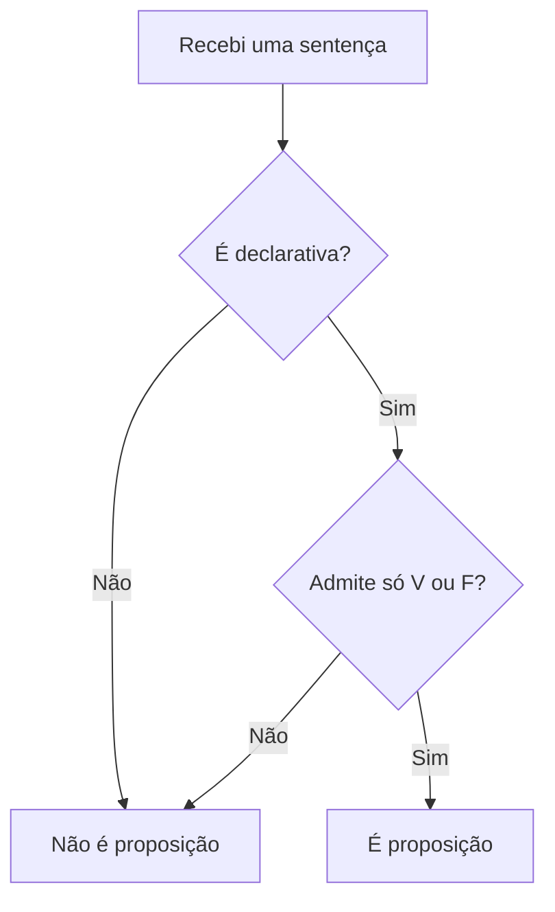
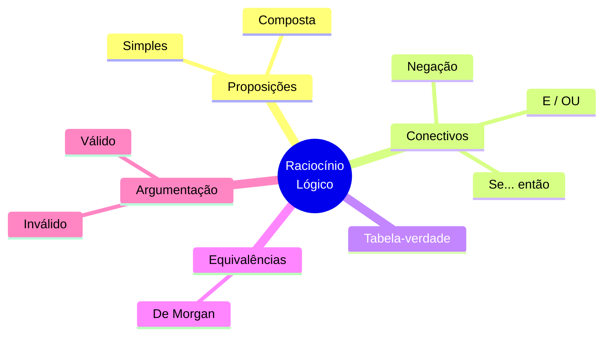
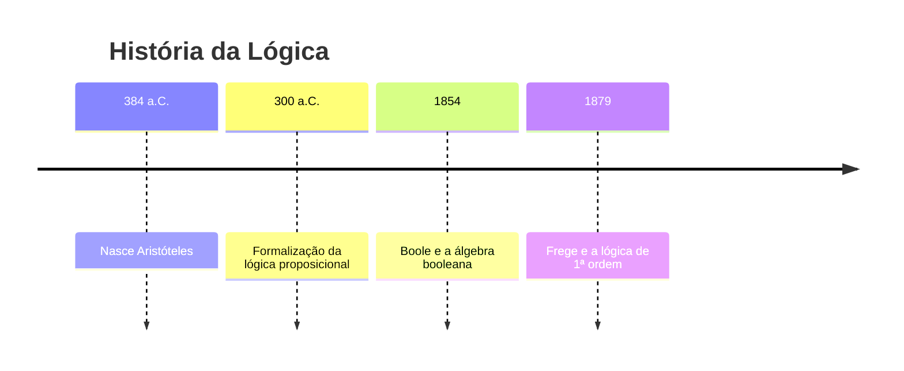
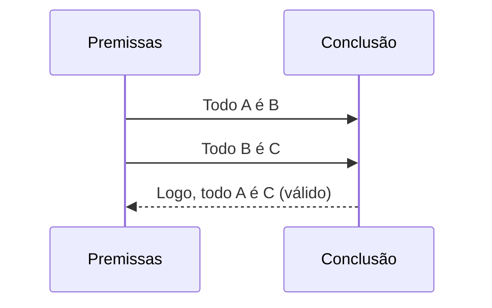
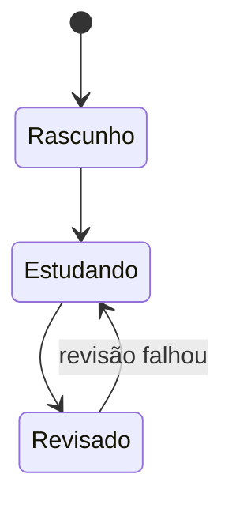
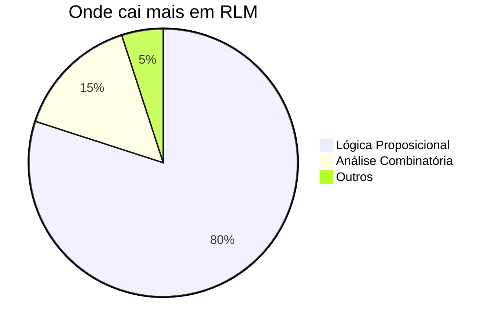
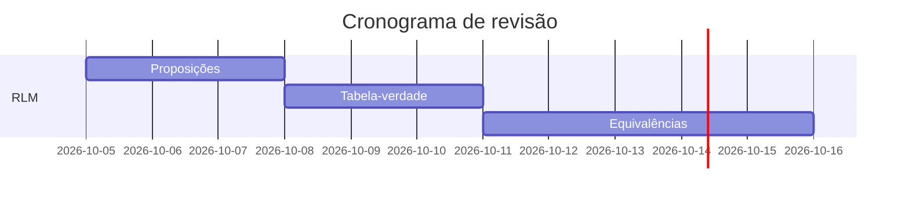

# 🎨 Diagramas a partir de texto (Mermaid)

Você escreve **texto** e o Obsidian (e o site) transformam em **esquema**. É só abrir um bloco de código com a linguagem `mermaid`.

No Obsidian, use ` ```mermaid ` e escreva o diagrama. No site (Quartz) ele aparece igual.

> [!tip] Teste rápido
> Copie um exemplo abaixo, cole numa nota nova e veja o desenho aparecer.

## Fluxograma (flowchart)



## Mapa mental (mindmap)



## Linha do tempo (timeline)



## Sequência (argumento)



## Estados (fluxo de revisão)



## Pizza e Gantt





## Dicas

- Site para montar/testar Mermaid: <https://mermaid.live>
- **Excalidraw:** dá pra converter um bloco Mermaid em desenho à mão livre — paleta de comandos → **Excalidraw: Mermaid to Excalidraw**.
- Tipos suportados: fluxograma, mapa mental, linha do tempo, sequência, estados, classe (ER), pizza, Gantt, quadrantes e mais.

## 🔗 Veja também

- [[atalhos-e-plugins|⚙️ Atalhos e plugins]]
