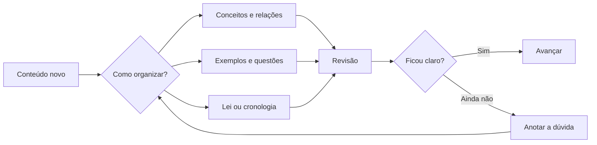
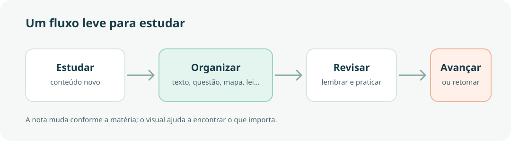

# Um visual consistente. Cada matéria com seu jeito.

Este guia define **sinais visuais**, não uma sequência obrigatória de tópicos. Em Português, uma nota pode ser feita de exemplos; em História, de uma linha do tempo; em Direito, de lei, entendimento e casos. Use apenas os recursos que ajudarem naquela nota.

## Caixas para destacar o que importa

> [!tip] Dica
> Atalho, macete ou forma rápida de lembrar. Use o verde para uma ajuda prática.

> [!warning] Atenção
> Regra que exige cuidado, condição que muda a resposta ou detalhe que costuma passar despercebido. O amarelo chama atenção sem parecer erro.

> [!danger] Pegadinha
> Uma afirmação que parece correta, mas troca uma palavra, condição ou consequência. O vermelho sinaliza risco de confusão.

> [!example] Exemplo
> Mostre a ideia funcionando em uma questão, frase, situação histórica ou aplicação.

> [!question]- Para revisar depois
> Caixas podem ser recolhidas. Guarde aqui uma pergunta que você quer tentar responder antes de abrir a explicação.
>
> Uma linha a mais pode ficar escondida até a hora da revisão.

## Títulos: uma hierarquia simples

O título da nota já aparece no topo da página. Dentro do texto, comece em **H2** para assuntos principais e use **H3** para partes menores. Não precisa numerar nem preencher todas as seções.

### Exemplo de seção menor

Escreva um parágrafo curto, uma lista, uma tabela, uma citação de lei ou uma questão resolvida — conforme a disciplina pedir. O estilo mantém títulos, espaçamento e leitura alinhados em todo o site.

## Esquema visual

Use Mermaid quando quiser transformar uma sequência ou relação em diagrama editável por texto. Este exemplo organiza um caminho de estudo sem obrigar a repeti-lo em todas as notas.



Para esquemas livres, mapas com cartões e setas, use o **Canvas do Obsidian**. Neste vault, a página Canvas do Quartz já está habilitada: o arquivo `.canvas` fica interativo e pode ser movido e ampliado no site. O Canvas de demonstração fica guardado em `content/.obsidian/mapa-de-estudo-demo.canvas` para não aparecer como conteúdo público.. O Excalidraw continua ótimo para desenhos à mão; a publicação de arquivos Excalidraw exige um plugin separado no Quartz.

## Imagens, capturas e anotações visuais

Arraste a imagem para a nota ou use o ícone de anexo do Obsidian. O vault está configurado para guardar anexos em `anexos`. Depois, insira a imagem onde ela ajuda a explicação:

```md
![[anexos/nome-da-imagem.png]]
```

Para imagem com largura definida, o Obsidian aceita `![[anexos/nome-da-imagem.png|600]]`. Em diagramas ou imagens extensas, confira a leitura no celular antes de publicar. Prefira incluir legenda ou uma frase explicando o que observar.

## Referência visual



A paleta é semântica: **verde** para dica, **amarelo** para atenção e **vermelho** para pegadinha. A estrutura do caderno continua sendo sua.

## Em uma nota nova

- Escolha o formato que combina com o assunto; não precisa começar por “introdução”.
- Use H2 e H3 para dar forma ao texto, sem saltar direto para títulos enormes.
- Destaque apenas o que precisa saltar aos olhos; várias caixas seguidas perdem o efeito.
- Prefira um diagrama ou uma imagem quando eles explicarem melhor que mais um bloco de texto.

[[como-usar-os-cadernos-digitais|Voltar ao guia principal]]
